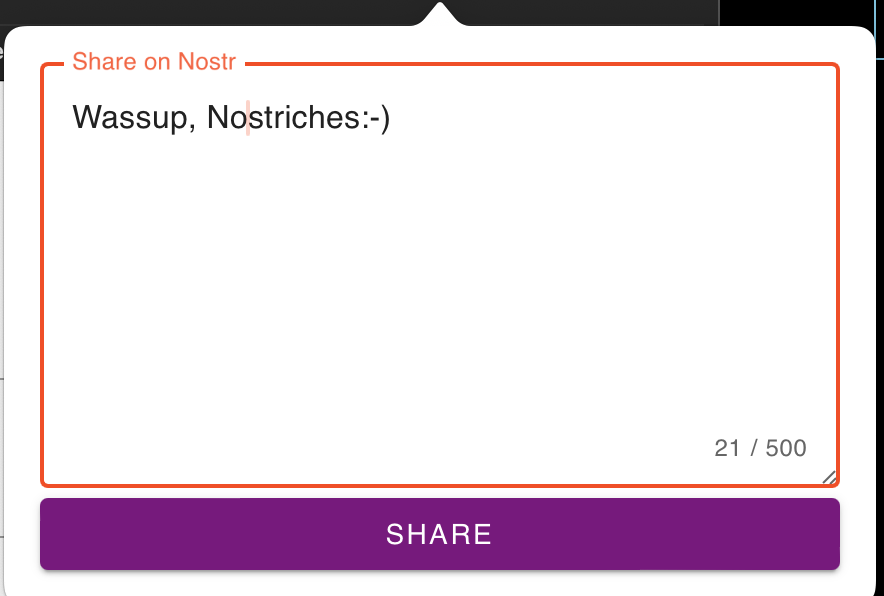
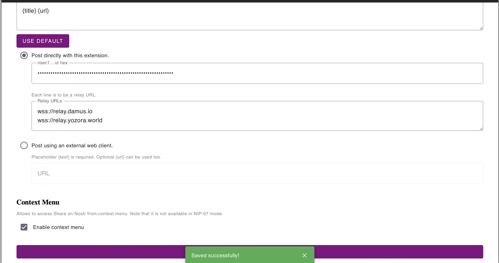

# Share on Nostr (Safari ver.)

Safari extension to share URL of an active tab on Nostr.

## Installation

Download the latest build.zip from [releases](https://github.com/higedamc/share-on-nostr/releases) and unzip it. Then, open it via Xcode to run it.

<!-- Or, install from [App store](https://chrome.google.com/webstore/detail/share-on-nostr/icfpjhfljddmpinehcnmlfijmiohhodi).  -->
<!-- Note that web store version may not the latest. -->

## Usage

Click the icon of this extension to share the page on Nostr.

Right click the icon to open preferences page.

## Troubleshooting

### Identity and type error

Just select "SwiftUI".

**This is the fork version of [share-on-nostr](https://github.com/penpenpng/share-on-nostr).**
